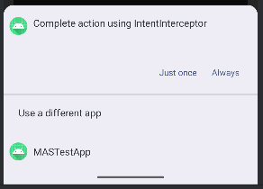

### Sample

This demo consits of two appluications. One which is vulnerable and one which hijacks the implicit intent and steals sensitve data from the vulnerable app.

#### Vulnerable App

The code snippet below demonstrates the use of an implicit intent which is comnsumed by the application itself again. This is an improper use of implicit intent as they are generally not used for interal IPC.

{ MastgTest.kt # AndroidManifest.xml }

The component `VulnerableActivity` within the vulnerable app originally intended to process sensitive data, but is exposed via an implicit intent mechanism. Intents targeted twoards this component can be hijacked by any app that claims to handle the same action.

{{ IntentInterceptorActivity.kt }}

#### Attacker App

The attacker app has an exported activity that includes a corresponding `<intent-filter>` which registers the custom action from the sample app, enabling it to capture the implicit intent sent out by the vulnerable app.

{ interceptor/IntentInterceptorActivity.kt # interceptor/AndroidManifest.xml  }

### Steps

### Compile and Install the Attacker App

1. Compile the attacker app with the package name `org.owasp.masattackerapp`
1. Install the attacker app on a device using @MASTG-TECH-0004.

### Install the Vulnerable App

1. Install the sample app on a device using @MASTG-TECH-0004.
1. On the vulnerable app, click on start to start the test.
1. Android will ask you which app sould be used to handle the intent. Choose "IntentInterceptor" as shown in the following figure: 

### Observation

The attacker app successfully intercepted the intent containing sensitive extras such as tokens, API keys, and credentials. This confirms that any app declaring a matching `<intent-filter>` can receive these values without restriction.

### Evaluation

The test fails due to the use of an exported activity (VulnerableActivity) that includes an intent filter with a custom action. Combined with the implicit intent in `MastgTest.kt`, this creates a vulnerable pattern where sensitive data is transmitted to an untrusted receiver.
